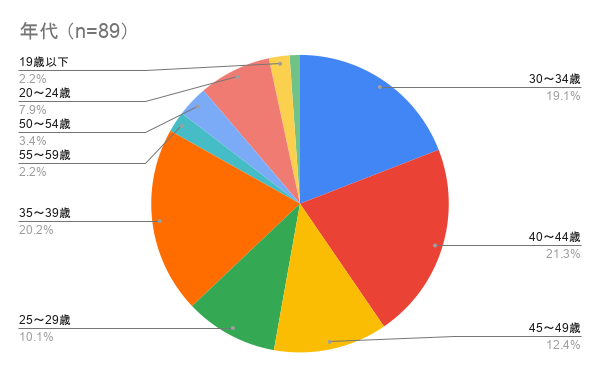
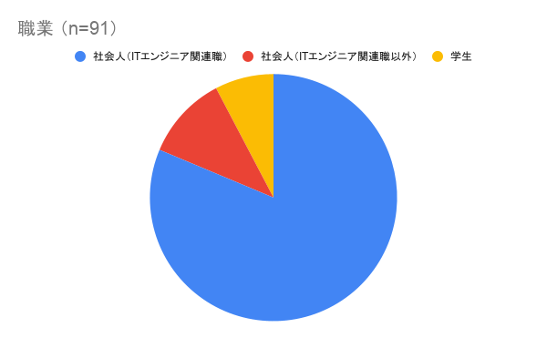

# NGK2027S 企業スポンサー募集要項
NGK2027Sでは「東海地方に縁のあるIT系コミュニティの発展を図る」という目的にご賛同いただける企業スポンサーを募集しております。

## 開催概要
NGKは「東海地方に縁のあるIT系コミュニティの発展を図る」という目的で年に1回開催しているイベントで、今回で第19回目を迎えます。

今回のNGK2027Sは、伊藤忠テクノソリューションズ株式会社様に会場を提供いただき開催いたします。

昼の部で100名程度の集客を見込んでおり、とくに今後のITエンジニア・コミュニティを担う学生の集客に力を入れたいと考えています。

なお学生参加者を増やすための施策として懇親会費用の補助（前回実績では学生は無料）を実施予定です。

## スポンサー費使途

いただいたスポンサー費は以下の用途に使用いたします。

* 学生・会場提供者および一般参加者向け懇親会費用補助
* 配信関連機材等の購入・レンタル費用
* 会場で使用する備品（名札等）の費用
* 参加者・運営メンバー向けノベルティの制作費用

万が一余剰金が発生した場合は、次回開催に繰越いたします。

## プラン

### 会場提供スポンサー
* 募集数：1社
* 今回の申込は締切りました
* 協賛内容：会場のご提供（金銭での協賛に代わるものです）

#### 特典
* 特典内容は、GOLDスポンサーと同一です。
* 会場を貸与いただく間（設営〜撤収）の立会をお願いするため、立会いただく方2名様分までの懇親会参加費を無料とします

### GOLDスポンサー
* 募集数：4社程度
* 一次締め切り：2026/10/30（金）22:00
    * GOLDスポンサーにはスポンサーLTの枠が付くため、一般LTとのバランスを見ながら募集数を調整します。
* 料金：50,000円（税込）

#### 特典

SILVERスポンサーの特典に加えて、スポンサーLT（1枠）でご登壇いただけます。

* イベント中の紹介
* イベント告知ページでのロゴ掲載
* 当日配布 チラシ・ノベルティ（種類多数の場合は調整をお願いする場合があります）
* イベント休憩時間におけるスライド配信（スライド1～2枚）
    * [NGK2025SでのCMスライド配信（参考情報）](https://www.youtube.com/live/vqi_GaxBuho?si=vOfWO9Mr6TcniN6p&t=3382)
* スポンサーLT（1枠）
    * 営利目的や求人目的の内容を話すことが可能です（一般・コミュニティLTでは禁止しています）
* ピッチ（1枠）
    * LT大会の最後に登壇し、告知や宣伝ができます。営利目的や求人目的でも構いません（口頭のみ）
    * 15秒/1枠
    * [NGK2026Sでのスポンサーピッチ（参考情報）](https://www.youtube.com/live/3VYHyrQYBjI?si=jbNeGEIeaKEeRfP2&t=12558)

 （イベント中の紹介・イベント告知ページでのロゴ掲載以外については任意です）

### SILVERスポンサー
* 募集数：4社程度
* 申込期限：2026/11/20（金）22:00
* 料金：10,000円（税込）

#### 特典
* イベント中の紹介
* イベント告知ページでのロゴ掲載
* 当日配布 チラシ・ノベルティ（種類多数の場合は調整をお願いする場合があります）
* イベント休憩時間におけるスライド配信（スライド1〜2枚）
    * [NGK2025SでのCMスライド配信（参考情報）](https://www.youtube.com/live/vqi_GaxBuho?si=vOfWO9Mr6TcniN6p&t=3382)
* ピッチ（1枠）
  * LT大会の最後に登壇し、告知や宣伝ができます。営利目的や求人目的でも構いません。（口頭のみ）
  * 15秒/1枠
  * [NGK2026Sでのスポンサーピッチ（参考情報）](https://www.youtube.com/live/3VYHyrQYBjI?si=jbNeGEIeaKEeRfP2&t=12558)

 （イベント中の紹介・イベント告知ページでのロゴ掲載以外については任意です）

## 注意事項

* 応募多数の場合、東海地方への関わりがある企業様を優先する場合がありますのでご了承ください。
* 「東海地方に縁のあるIT系コミュニティの発展」に関係がない場合やイベントの趣旨に合わない場合など、実行委員会が適切でないと判断した場合はお断りいたします。
* 当日参加される方は、別途connpass申し込みページからお申し込みが必要です。

## 申込方法

[Googleフォーム](https://docs.google.com/forms/d/e/1FAIpQLSfY8W9tO1mlo8bFgGVLTVIJy1PQlG3cHZPZJLXd3G4n2w2sDQ/viewform?usp=header)からお申し込みください。入力いただいたメールアドレスまたはDiscordにてご連絡いたします。

**当日参加される方は別途 connpass [昼の部ページ「オフライン参加枠」](https://ngk.connpass.com/event/408358/)・[夜の部ページ](https://ngk.connpass.com/event/408359/)よりお申し込みが必要です。**

## 前回（NGK2026S）開催実績

株式会社エイチームホールディングス様に会場を提供いただき開催いたしました。

9社の企業スポンサー様のご支援をいただき、ライトニングトーク（昼の部）には 96名（前年度比-11名）、懇親会（夜の部）には 72名（前年度比+2名）の方にご参加いただきました。

参加者の分布は以下の通りです。（回答数: 年代 89、職業 91）

#### 参加者 年代

#### 参加者 職業

詳細は以下ページをご覧ください。

* [NGK2026S 申し込みページ（昼の部）](https://ngk.connpass.com/event/373265/)
* [NGK2026S 申し込みページ（夜の部）](https://ngk.connpass.com/event/373524/)
* [NGK2026S 動画アーカイブ](https://www.youtube.com/watch?v=3VYHyrQYBjI)
* [NGK2026S X（旧twitter）でのツイート](https://x.com/search?q=%23NGK2026S)
* [NGK2026S 開催結果報告書](https://nagoya-godo-konshinkai.github.io/ngk2026s/report/NGK2026S_conference_results.pdf)
* [NGK2026S 収支報告書](https://nagoya-godo-konshinkai.github.io/ngk2026s/report/NGK2026S_financial_results.pdf)

## その他

### 掲載ロゴについて

イベント告知等に使用するロゴ画像をご提供ください。ご提供いただき次第、掲載いたします。

* ファイル形式：png, jpg, pdf, ai　※他の形式を希望される場合はご相談ください。
* 推奨解像度：768px × 768px
* 注意事項
  * ご提供いただいた画像が正方形でない場合は、白色のマージンを追加して正方形化して使用します。
  * ご提供いただいた画像は、適切な解像度へリサイズして使用します。

### イベント休憩時間におけるスライド配信について

スライド配信をご希望の場合は、提出期限までにスライドをご提出ください。

* 提出期限：2026/12/25（金）22:00
* ファイル形式：png, jpg, pdf, ai　※他の形式を希望される場合はご相談ください。
* 推奨解像度：1920px × 1080px
* スライド数：1～2枚
* 注意事項
  * スライドの外周にロゴやテロップを重ねる場合があります。そのため、上下左右10%を除いた中央90%をセーフエリアとしてレイアウトしてください。

### スポンサー費用について

イベント終了後に請求いたします。

請求は、費用授受代行を行う有限会社来栖川電算からの請求となります。

また、領収書（インボイス対応）の発行も可能です。
